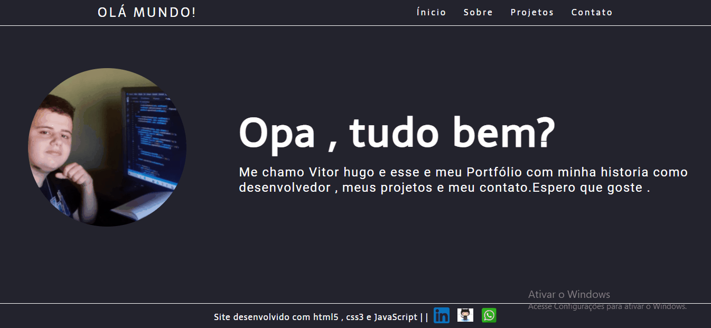

<h1 align="center" >Meu Portifólio<h1>
<h2 align="center">Ainda esta em fase inicial</h2>

<h2 color="blue" align="center">
<a href="https://VitorHRD.github.io/Portifolio/">🔗 Site</a>
</h2

<h1 align="center"> 🚀Site em funcionamento<h1>
</img>
<h1>🚀 Tecnologias</h1>
 
 <ul>
     <li> HTML5
      <li> CSS3
       <li> JavaScript
        <li> Bootstrap
 </ul>
 
<h1 > 🚀 Status do Projeto </h1>
 
 
 🚧   Em construção... 🚧 

 
 
 
Feito por Vitor Reis

